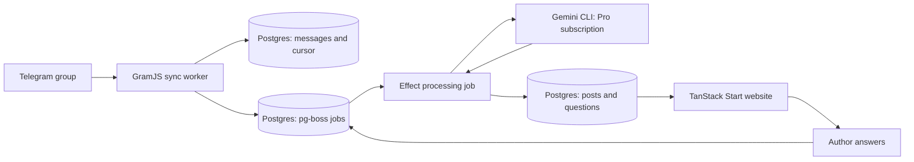

# Current architecture

Updated 6 September 2026. This replaces the initial stack recommendation in research.md. It is a design, not an implemented application.

Review the proposed screens and numbered deliveries in [the HTML implementation plan](./implementation-plan.html) ([Markdown](./implementation-plan.md)).

Selected by the user: GramJS for automatic Telegram history and incremental reads; React with Vite and TanStack Start; useful TanStack libraries; Effect v4 throughout the application; Gemini 3.8 Flash with the user's Google AI Pro subscription. The user confirms permission to use this group's content. Treat that confirmation as the working authorization; a public invite link by itself is not the authorization.

Use one TypeScript repository, two Node processes, and one PostgreSQL database. The web process serves pages and handles user actions. The worker collects messages and generates posts. Both use the same Effect services and database schema.

## Stack and responsibilities

| Component | Responsibility |
| --- | --- |
| React + TanStack Start + Vite | Website, server rendering, server functions, production builds |
| TanStack Router, included through Start | File routes, typed links, validated URL filters, route loading |
| TanStack Query | Feed/detail caching, pagination, mutation refresh, background refresh of processing status |
| TanStack Form | Post editing, comments, answers, shared schema validation |
| Effect v4 | Business rules, typed errors, resource lifetimes, bounded concurrency, deadlines, logs and traces |
| Effect Schema | Domain types and runtime validation of Telegram input, model output, forms and server input |
| PostgreSQL + @effect/sql-pg | Durable data, migrations, queries and transactions |
| pg-boss | Persisted jobs, scheduled sync, retries, concurrency and failed-job inspection |
| GramJS | Your authenticated user session reads only the configured group |
| Gemini CLI + Google sign-in | Use Google AI Pro subscription quota; request gemini-3.8-flash and verify CLI/account access during setup |
| Auth.js core | Proposed Telegram OIDC and X OAuth integration with database sessions |
| Railway | Web service, worker service and PostgreSQL, with backups enabled |

Start supplies both the server and browser sides, with Router as its routing foundation and Vite as a supported build tool. Its current overview calls it a release candidate. This selection follows the requested ecosystem; no application benchmark has established that it is faster than the previous proposal. [Start overview](https://raw.githubusercontent.com/TanStack/router/main/docs/start/framework/react/overview.md)

Use TanStack Table when the administrator review screen needs tabular sorting/filtering, and Virtual when measured feed size makes rendering expensive. Query covers the initial feed, comments and dashboard. TanStack DB adds client collections and live queries; it does not replace PostgreSQL or the durable job system. [TanStack DB](https://old.tanstack.com/db/latest/docs/overview)

Effect owns application execution, while TanStack owns UI data fetching and forms. Convert Effect programs to promises only at Start handlers and third-party callbacks. Reuse Effect Schema through its Standard Schema conversion in Form. [Form validation](https://tanstack.com/form/latest/docs/framework/react/guides/validation), [Effect Schema conversion](https://github.com/Effect-TS/effect/blob/main/packages/effect/src/Schema.ts)

Pin matching Effect v4 package versions. The inspected main-branch package currently identifies itself as 4.0.0-rc.112; this is not a claim that the same version has been verified in npm. The older migration introduction still says beta. SQL and several other modules remain under unstable paths. Keep that changing integration code in a few server modules. [Current package](https://github.com/Effect-TS/effect/blob/main/packages/effect/package.json), [migration and versioning](https://github.com/Effect-TS/effect/blob/main/MIGRATION.md)

Run the official Gemini CLI as a scoped subprocess inside Effect, authenticated with Google sign-in. This follows the user's explicit choice to use subscription quota. gemini.ts owns process startup, input, output parsing, cancellation and error mapping. There is no direct @google/genai connection or API-credit funding in the selected design. [CLI authentication](https://geminicli.com/docs/get-started/authentication/), [headless mode](https://geminicli.com/docs/cli/headless/)

## Proposed file tree

```text
tg-private-social-network/
├── package.json                 # dev, build, web, worker, migrate, test
├── vite.config.ts               # Start + React build configuration
├── .env.example                 # Required settings; no real credentials
├── src/
│   ├── routes/
│   │   ├── index.tsx            # Public project feed
│   │   ├── posts.$postId.tsx     # Post and comments
│   │   ├── dashboard.tsx        # My posts and unanswered questions
│   │   └── api.auth.$.ts        # Telegram/X authentication endpoints
│   ├── components/              # Cards, editors, question forms
│   ├── queries/                 # Shared TanStack Query definitions
│   ├── domain/                  # Effect schemas: Post, Author, Question
│   ├── server/
│   │   ├── functions.ts         # Start server functions: validate and call services
│   │   ├── auth.ts              # Sessions, providers, explicit account linking
│   │   ├── runtime.ts           # Wire Effect services and resource lifetimes
│   │   ├── posts.ts             # Read/edit/publish/answer/comment rules
│   │   ├── telegram.ts          # GramJS connection and normalized message reads
│   │   ├── gemini.ts            # Gemini CLI subprocess, JSON parsing, quota errors
│   │   ├── database.ts          # Effect SQL and transactions
│   │   └── jobs.ts              # pg-boss setup and transaction bridge
│   └── worker/
│       ├── main.ts              # Start collector and job consumers
│       ├── sync.ts              # Backfill, incremental cursor, reconciliation
│       └── summarize.ts         # Group messages and create/revise posts
├── db/migrations/               # Explicit SQL schema changes
├── tests/                       # Recovery, ownership, deduplication, stale revisions
└── docs/
    ├── implementation-plan.md   # Reviewable screens and small deliveries
    ├── architecture.md          # Current decisions and flows
    └── research.md              # Initial research and remaining auth caveats
```

These are proposed files. Only the documentation exists. Split modules when their responsibilities grow; separate packages, a monorepo framework and duplicated service interfaces are unnecessary for the current scope.

## Message flow



The two writes from the collector are one transaction, not independent sends.

1. On first startup, capture a seven-day cutoff and a fixed upper message ID. Import in bounded pages, recording a resumable backfill position. Complete the range before promoting the incremental cursor.
2. Schedule an incremental sync every minute as an initial setting. Read beyond the last completed cursor, exhausting the snapshot range before advancing it. One collector owns this chat at a time. Persist source messages and jobs before recording progress. GramJS supports date/ID pagination and flood-wait pacing. [GramJS iteration](https://gram.js.org/beta/interfaces/client.message.IterMessagesParams.html)
3. Debounce related messages briefly, grouping by author, thread/replies, album and project link. Queue a bounded classification/summary job. Ingestion continues even when model jobs are paused or slow.
4. Request an ignore decision or JSON post proposal: title, short explanation, evidence/source IDs, links and missing-information questions. Parse the CLI JSON envelope, then parse and validate its response string with Effect Schema; CLI JSON output alone does not enforce the post schema. Application code verifies source references and author ownership.
5. Save the post and questions. Automatically publish entries that satisfy the agreed selection and attribution rules; send uncertain matches to review. This follows the requested automatic-entry flow. The author can edit or remove their entry after login.
6. Answers persist immediately and enqueue a revision job. Human-edited fields remain protected from automatic replacement. There is no running agent waiting for somebody to answer.

Message-ID polling finds additions. Track edits and deletions through MTProto updates/recovery or explicit reconciliation of known messages; do not describe a highest-ID cursor as complete synchronization. [Telegram update synchronization](https://core.telegram.org/api/updates)

## Why both Effect and pg-boss

Effect handles what happens during an attempt: resources, cancellation, timeouts, typed failures and limited concurrency. pg-boss stores which work exists and when another attempt should run, including after a process restart. Effect Queue is in-process coordination, not the persistent job store selected here.

Use separate sync and model job queues. A model quota pause must not stop Telegram collection. Let pg-boss own job-level retry schedules; reserve short Effect retries for narrowly identified transient operations so nested retries do not multiply unexpectedly. A failed job remains inspectable and replayable.

The SQL integration needs a small tested bridge: pg-boss accepts an executeSql adapter, while Effect SQL exposes the current transaction connection. jobs.ts must execute enqueue SQL on that exact connection. Passing the same database URL to separate clients does not produce one transaction. Prove that a forced rollback removes the message, cursor change and job together. [pg-boss transaction adapter](https://pgboss.io/api/adapters), [Effect SQL transaction service](https://github.com/Effect-TS/effect/blob/main/packages/effect/src/unstable/sql/SqlClient.ts)

Use unique source-message and source-revision keys, and conditional post-version writes. These prevent duplicate posts and stale AI overwrites. They do not guarantee that an external model call happens only once after an ambiguous failure. Keep model usage and completed results with the job record.

## Website flow and ownership

```text
Open a post
  Router chooses page and loads its query
  Query calls a Start server function
  Function runs the Effect post service
  Service reads Postgres
  Query caches the response and React renders it

Answer a question
  Form validates the shared Effect schema
  Server revalidates input and checks ownership
  Transaction saves the answer and a revision job
  Query refreshes the dashboard
  Worker generates a suggested revision asynchronously
```

The GramJS reader uses the project owner's session. Website users log in separately with Telegram OIDC or X OAuth. Match a Telegram author by the verified numeric Telegram user ID, and link X explicitly to the same internal account. X-only login permits comments, not ownership of somebody's Telegram posts. Keep all reader credentials server-side.

A BotFather bot is still needed to represent the website's Telegram login; it need not collect group messages. Follow-up questions can stay on the website. Direct-message notifications can be added later through the Bot API if desired. Telegram's verified profile includes an id distinct from the OIDC sub and omits email/UserInfo, so retain the Auth.js custom-provider verification spike described in research.md. [Telegram login](https://core.telegram.org/bots/telegram-login)

## Google subscription access

Confirmed plan: Google AI Pro. Confirmed access preference: Google sign-in and subscription quota through the official Gemini CLI. API credits and separately billed Gemini API calls are not part of this design.

Sign in once through Gemini CLI using the account holding the Pro subscription. The CLI caches credentials, and its headless mode reuses existing authentication. On the worker host, provide persistent protected storage for that CLI session and let the CLI manage authentication; do not extract its tokens for an undocumented client. [Authentication and headless reuse](https://geminicli.com/docs/get-started/authentication/)

For each model job, start a bounded headless CLI process requesting `gemini-3.8-flash`, pass the prompt as data, and request JSON output. The envelope contains a response string and statistics; parse the response separately and validate it with Effect Schema. Use an isolated working directory and a no-tools profile with extensions/MCP disabled for this summarization task. Limit process concurrency, output size and duration. [Headless mode](https://geminicli.com/docs/cli/headless/)

Google documents a maximum of 1,500 model requests per day for Pro, with per-minute limits and availability constraints. A job can consume multiple model requests. On quota exhaustion, pause model jobs until the appropriate retry/reset time while Telegram ingestion continues. Authentication failure requires reauthentication, not a paid fallback. Do not configure API-key/Vertex authentication or enable paid overages for this worker. [Subscription quotas](https://geminicli.com/docs/resources/quota-and-pricing/)

Selected model remains Gemini 3.8 Flash. Its stable public API identifier is `gemini-3.8-flash`, but public API availability does not prove access through this account's CLI subscription backend. CLI documentation supports selecting available models with `--model`; the inspected model documentation/constants did not establish 3.8-specific CLI availability. Verify a signed-in request and the reported actual model during setup. Do not silently substitute another model or use paid API access if unavailable. Treat low thinking effort as a desired setting only if exposed by the chosen CLI version. [Model specification](https://ai.google.dev/gemini-api/docs/models/gemini-3.8-flash), [CLI model selection](https://geminicli.com/docs/cli/model/)

Only documentation was changed. No external accounts were accessed, no billing was activated, and no model requests were made during this research. The remaining setup proof is a successful subscription-authenticated CLI request to the requested model.
